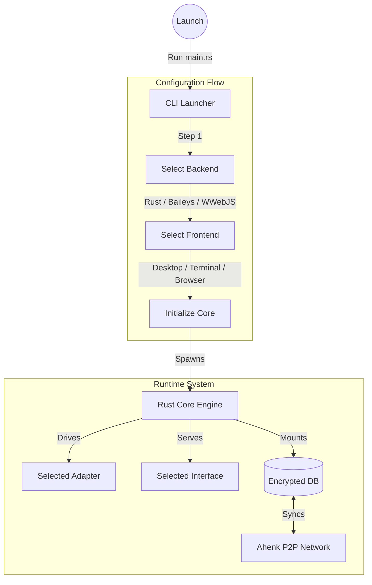
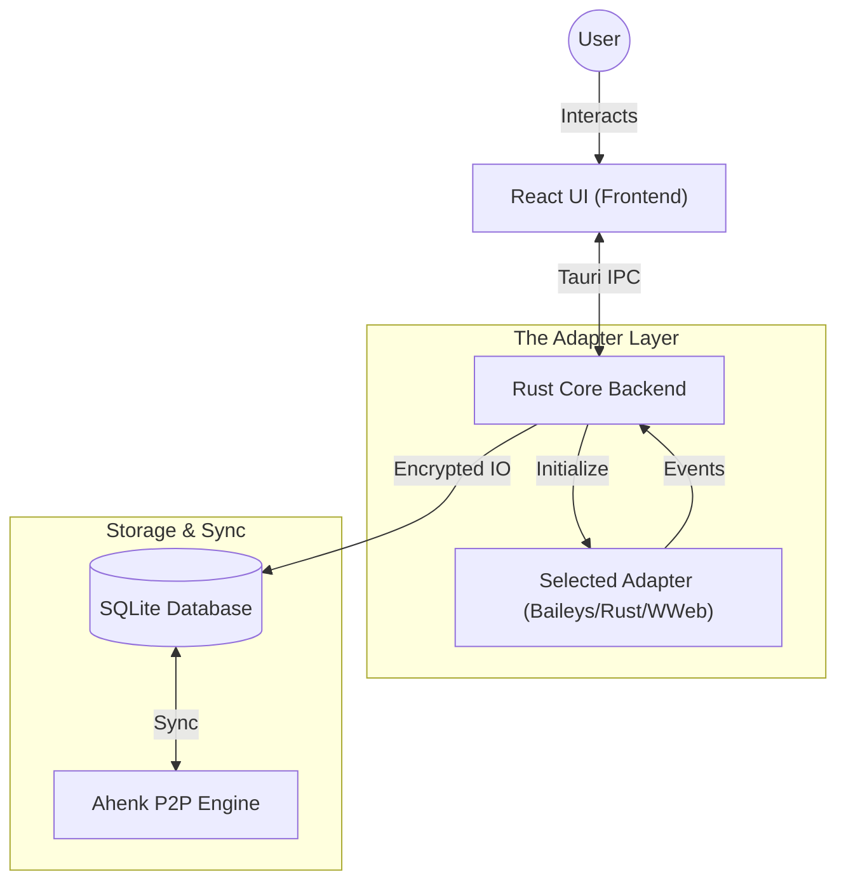
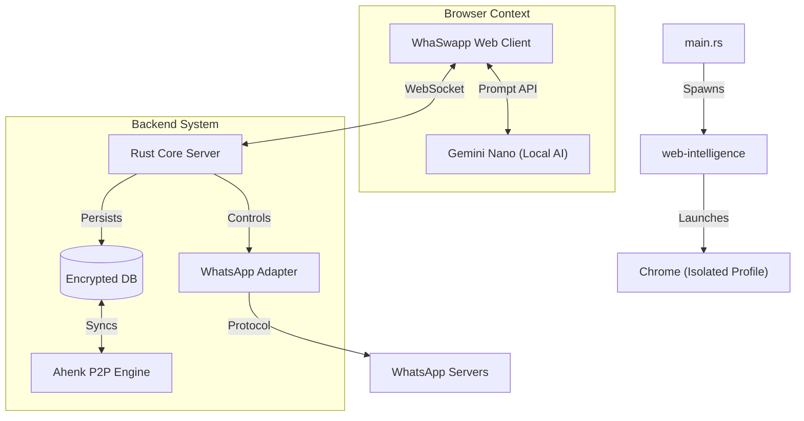
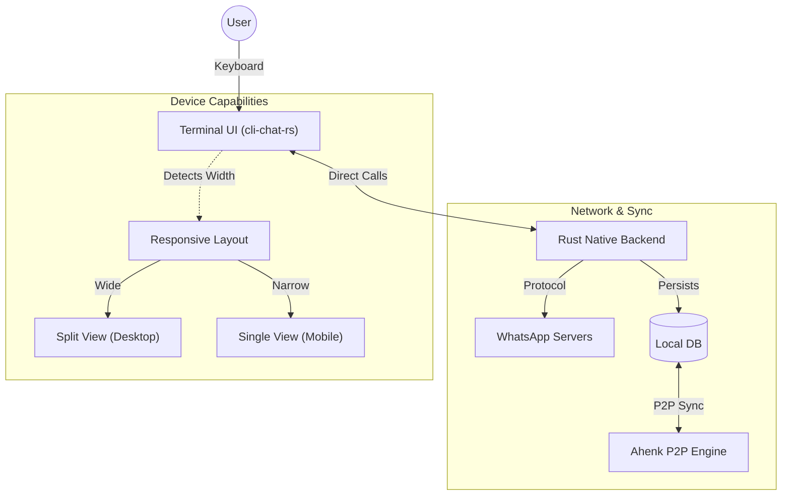
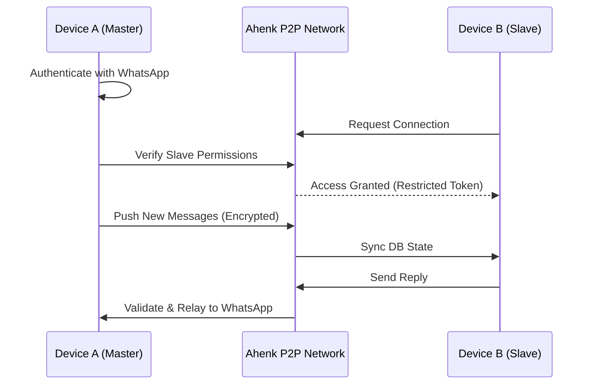

> **Status:** 🚧 **Public Beta** 🚧
> This software is currently under active development. Features may be incomplete, and stability is not guaranteed. Please check the [Issues](https://github.com/KodFikirSanat/WhaSwapp/issues) page for known bugs.

<table border="0">
  <tr>
    <td width="150" align="center">
      
    </td>
    <td>
      <h1>WhaSwapp (BETA)</h1>
      
<b>Lightweight, Privacy-Focused, Modular.</b>

    </td>
  </tr>
</table>

**WhaSwapp** is a lightweight, privacy-focused, and modular WhatsApp client. It serves as a rebellion against the resource-heavy official clients, offering a "clean slate" experience that respects your system resources and your data.

## ⚡ Why WhaSwapp?

The official WhatsApp desktop clients have become increasingly bloated, consuming excessive RAM and lacking the flexibility power users demand. WhaSwapp was born from a simple need: **A high-performance, low-latency client that does exactly what it's supposed to do—chat—without the bloat.**

## 🏗️ Architecture

WhaSwapp is not a single monolithic application. It is a modular system composed of interchangeable **Adapters** (Backends) and **Interfaces** (Frontends).

### 1. The Startup Matrix

When you launch WhaSwapp, the CLI Launcher guides you through configuring your session. Once the "Weapon" (Backend) and "Battlefield" (Frontend) are chosen, the core system initializes the storage and synchronization engines.

### 2. Scenario A: The Standard Desktop (Tauri)
*Best for: Daily usage on Windows/Linux/macOS.*

In this mode, the **Rust Core** acts as the central hub. It manages the chosen Adapter (e.g., Baileys) via IPC and serves the UI via Tauri.

### 3. Scenario B: Browser Mode with Local AI
*Best for: Development, Debugging, and Leveraging Local LLMs.*

This mode uses `web-intelligence` to launch a dedicated, isolated Chrome instance. It connects to the Rust Core via WebSocket/HTTP, enabling a full "Headless Server + Browser UI" architecture with built-in P2P sync and AI.

### 4. Scenario C: The Terminal Warrior (TUI)
*Best for: Servers, SSH, Termux (Android), and Low-RAM environments.*

Here, the GUI is stripped away. The **Rust Native** backend connects directly to `cli-chat-rs`. Crucially, **Ahenk** remains active, allowing this terminal instance to stay in sync with your desktop.

## 🔄 Ahenk Synchronization

WhaSwapp integrates **Ahenk**, a decentralized P2P synchronization engine. Unlike the official Multi-Device implementation which relies entirely on WhatsApp servers, Ahenk allows your WhaSwapp instances to talk directly to each other.

### Capabilities
*   **True P2P Sync:** Sync message history between your Desktop and Termux without cloud reliance.
*   **Master/Slave Architecture:**
    *   **Master Node:** Holds the primary connection to WhatsApp.
    *   **Slave Node:** Connects to the Master via Ahenk. Can be given **restricted permissions** (e.g., "Read Only", "No Media", "Group A Only").
    *   *Ideal for corporate environments or parental control.*

## 🔮 Planned Capabilities

While we currently focus on core functionality, the architecture supports powerful extensions (see `FEATURES.md` for details):

*   **Ghost Mode:** View messages and statuses without sending receipts.
*   **Anti-Delete:** Retain messages even if the sender deletes them.
*   **Local AI:** On-device summarization and smart replies using `web-intelligence` (Gemini Nano).
*   **View Once Save:** Archive ephemeral media.

## 🔗 Project Ecosystem

WhaSwapp is built on the shoulders of giants and modular internal libraries:

<table align="center">
  <tr>
    <td align="center" width="200">
      
    </td>
    <td align="center" width="200">
      
    </td>
    <td align="center" width="200">
      
    </td>
  </tr>
  <tr>
    <td align="center">
      <b><a href="https://github.com/WhiskeySockets/Baileys">Baileys</a></b> 
      The stable Node.js engine powering our default backend.
    </td>
    <td align="center">
      <b><a href="https://github.com/jlucaso1/whatsapp-rust">whatsapp-rust</a></b> 
      High-performance Rust implementation (Active Contribution).
    </td>
    <td align="center">
      <b><a href="https://github.com/pedroslopez/whatsapp-web.js">whatsapp-web.js</a></b> 
      Legacy web automation wrapper for compatibility.
    </td>
  </tr>
</table>

### Internal Libraries
*   **[cli-chat-rs](./libs/cli-chat-rs):** Our responsive Terminal UI library that adapts to desktop or mobile screens.
*   **[web-intelligence](./libs/web-intelligence):** Hardware-accelerated local AI integration.
*   **[Ahenk](https://github.com/Appaholics/Ahenk):** Our P2P synchronization and state management crate.

---
*Disclaimer: This project is an independent effort and is not affiliated with, authorized, maintained, sponsored, or endorsed by WhatsApp or any of its affiliates.*
